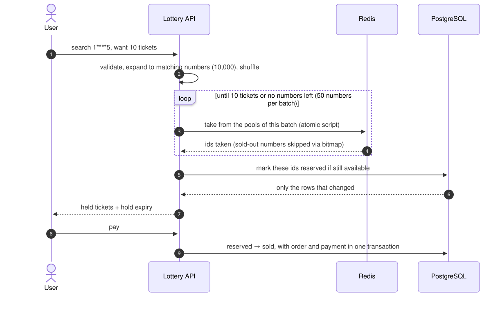
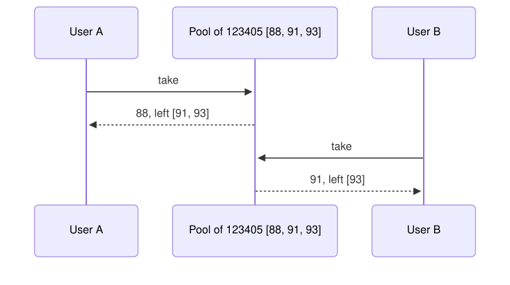

# Lottery Search System — Design

A system that searches and allocates 10 million lottery tickets by a 6-character pattern with `*` wildcards. Users who search the same pattern at the same time always get different tickets.

## Design summary

- **PostgreSQL** is the source of truth for the state of every ticket.
- **Redis** is the allocation layer. Available tickets are kept in one pool per number and handed out atomically with `SPOP`, which picks and removes in a single command.
- Search never scans tickets. The pattern is expanded into the numbers it can match, shuffled, and tickets are taken from those numbers' pools.
- A ticket that is taken is held for 10 minutes. Paid, it belongs to the buyer; unpaid, it goes back to its pool.
- When Redis is unavailable, the system allocates straight from PostgreSQL with row locks that skip rows already locked by someone else (`SKIP LOCKED`).

## 1. Key space

A 6-digit number has 1,000,000 possible values, so 10 million tickets average 10 per number (several sets per number). The system treats the data as **1 million slots, each holding a pool of about 10 tickets**.

A pattern with k wildcards matches 10^k numbers. That count drives the whole search strategy.

| Pattern | k | Matching numbers | Matching tickets (approx.) |
|---|---|---|---|
| `123456` | 0 | 1 | ~10 |
| `12345*` | 1 | 10 | ~100 |
| `123***` | 3 | 1,000 | ~10,000 |
| `1****5`, `****23` | 4 | 10,000 | ~100,000 |
| `******` | 6 | 1,000,000 | ~10,000,000 |

## 2. Architecture

| Component | Responsibility |
|---|---|
| Lottery API | Validates the pattern, expands it into numbers, takes tickets from Redis, records holds in PostgreSQL. Holds no state. |
| Redis | Available-ticket pools per number, plus a 1-million-bit bitmap of which numbers still have stock. |
| PostgreSQL | The state of every ticket; the final word on who owns what. |
| Sweeper | Returns tickets whose hold has expired to their pools. |
| Reconciler | Rebuilds the Redis pools from PostgreSQL when Redis restarts, and repairs drift periodically. |

## 3. Data model

### Tickets (PostgreSQL)

| Field | Meaning |
|---|---|
| id | Ticket id |
| number | 6-digit number |
| set_no | Set number (the same number is printed in several sets; `number + set_no` is unique) |
| d1 – d6 | Each digit as its own column, derived from `number` |
| status | `available` / `reserved` / `sold` |
| reserved_by, reserved_until | Holder and hold expiry |

**Indexes**
- One partial index per digit (`d1`–`d6`) over `available` tickets only. A wildcard in any position can still use an index, because the database combines several digit indexes in one query, and the indexes shrink as tickets sell.
- An index on hold expiry for the sweeper.

### Pools (Redis)

| Structure | Size | Content |
|---|---|---|
| One set per number (1 million sets) | ~10 ids per set | Ids of that number's available tickets |
| Bitmap `instock` | 1,000,000 bits = 125 KB | Bit for a number = 1 while that number still has an available ticket |

### Ticket lifecycle

## 4. Search and allocation

**Building the number sequence**
- k ≤ 4 (at most 10,000 numbers): expand every number and shuffle in memory.
- k ≥ 5: fill the wildcards with random digits one number at a time, without repeats. Matches are plentiful, so a few rounds are enough.

The shuffled order spreads users who search the same pattern across different pools instead of all hitting the first one.

**Taking tickets.** Each batch of numbers goes into one script on Redis. For every number the script checks the bitmap first and skips sold-out numbers, takes one id from the pool otherwise, and clears the number's bit once its pool is empty. Redis runs the whole script with no other command in between.

**Holding tickets.** PostgreSQL only changes tickets that are still `available`, and the user receives only the ids that actually changed.

`limit` is capped at 50 tickets per request.

## 5. Concurrency

| Layer | Mechanism | Guarantee |
|---|---|---|
| 1 | Atomic take from the Redis pool | An id leaves its pool once; two users can never get the same ticket |
| 2 | Hold in PostgreSQL conditioned on `available` | An id that is no longer available never reaches a user, even if Redis has drifted |
| 3 | `reserved` status + expiry | A held ticket does not return to its pool until the hold expires |

There are no locks: no lock per pattern (everyone queues behind one lock) and no lock per ticket (retry loops on every collision). Taking a ticket removes it from the pool in the same step, so there is no window for a collision and nobody waits for anybody.

**Fallback.** Without Redis, the API searches PostgreSQL through the per-digit indexes and locks the rows it takes, skipping rows someone else has locked (`SKIP LOCKED`). Concurrent requests get different rows without waiting on each other. Slower than the main path, equally correct.

## 6. Storage

**PostgreSQL** (source of truth)
- Multi-row ACID transactions cover holds, sales, orders, and payments.
- `SKIP LOCKED` gives a correct fallback out of the box.
- Partial indexes and index combination support a wildcard in any position.
- Mature tooling for backup, replication, and monitoring.

**Redis** (allocation layer)
- Atomic allocation in one round trip.
- Sub-millisecond latency for sale-day traffic.
- Not the source of truth: data in RAM can be lost on a crash, and everything can be rebuilt from PostgreSQL.

## 7. Performance

Back-of-the-envelope from data sizes; nothing here is benchmarked yet.

- The ticket table is 10M rows at roughly 80–100 bytes each (~28 bytes of row overhead + ~55 bytes of data), so ~1 GB. Six per-digit index entries at ~20–25 bytes add ~1.2–1.5 GB at the start of sales, plus ~200 MB for the primary key.
- Redis holds 10M ids in 1M intset-encoded sets at ~150–250 bytes per key, ~200–400 MB with room for fragmentation. Both PostgreSQL and Redis fit comfortably in RAM.
- The heaviest pattern has four wildcards and expands to 10,000 numbers, but most numbers still have stock, so the first batch of 50 usually fills the request. Wider patterns are easier; narrow patterns have only a handful of numbers to try.
- Near sell-out is when many numbers have to be walked. The bitmap keeps that cheap: it is a bit check in RAM rather than an `SPOP` against an empty pool.
- A request should land in single-digit milliseconds, around 5–10 ms, mostly spent writing to PostgreSQL (index updates and the WAL commit) rather than searching. This is a rule of thumb, good for the order of magnitude only.
- Throughput is not something I can put a number on yet. Redis handles roughly 100,000 simple commands per second, but one request runs 50–150 `GETBIT`/`SPOP`/`SCARD` calls inside a script. Dividing naively gives 1,000–2,000 requests per second; the real figure should be higher because script-internal calls skip the network, but how much higher needs measuring.

If sale-day traffic outgrows one machine, the API scales out immediately since it holds no state, and Redis shards by the first digit of the number.

## 8. Risks

Only a few things are real concerns.

- **Redis and PostgreSQL drift apart.** That is the price of two systems, but only Redis can be wrong: the hold in PostgreSQL is conditioned on `available`. The worst outcome is a ticket missing from its pool until the next Reconciler run puts it back. It can never be sold twice.
- **Redis goes down.** Sales continue through the PostgreSQL fallback, just slower, while the Reconciler rebuilds the pools.
- **Popular numbers right before the draw.** Users will pile onto the same pool, but `SPOP` has no queue to wait in. When the pool is empty the answer is "sold out", immediately.
- **Hoarding holds without buying.** This needs a per-user rate limit and a cap on open holds, or one person can keep a whole number held 10 minutes at a time indefinitely. It is a policy question to settle with the business side too.

What is not proven yet is the latency and throughput in section 7. It needs a load test with thousands of concurrent requests on the same pattern before those numbers can be trusted.
